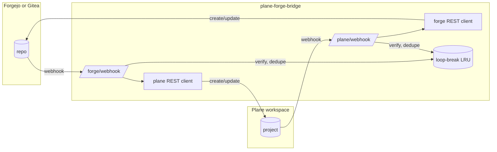

# plane-forge-bridge design

This is the living design doc. It expands the brief that scaffolded the repo
into something a new contributor can read end-to-end. The repo skeleton is in
place but no behavior is implemented yet, so most of what follows describes
intent. Updates are expected as the implementation lands — please edit this
file alongside the code rather than letting the two drift.

The brief lives in [AGENTS.md](../AGENTS.md) and the public summary in
[README.md](../README.md); this doc is the connective tissue between them.

# Purpose and relationship to Plane and Forgejo

`plane-forge-bridge` is a bidirectional webhook bridge between
[Plane](https://plane.so) and any Gitea-API-compatible forge
([Forgejo](https://forgejo.org/), [Gitea](https://about.gitea.com/)). The goal
is rough feature parity with Plane's first-party GitHub and GitLab connectors
for issues, comments, labels, state, and PR-driven work-item state automation.

Plane's first-party connectors live in a closed-source service called
**silo**, distributed via `artifacts.plane.so/makeplane/silo-commercial`. The
OSS [`makeplane/plane`](https://github.com/makeplane/plane) repository
contains no connector code, so contributing Forgejo support as a PR upstream
is not possible — there is no upstream surface to attach it to.
[makeplane/plane#1495](https://github.com/makeplane/plane/issues/1495) (the
"Forgejo support" issue) has been open since 2023 without a maintainer
response, which is what motivated a satellite repo rather than a fork.

There is already a paid third-party Forgejo plugin for Plane, discussed in
[makeplane discussion #8796](https://github.com/orgs/makeplane/discussions/8796).
This project is the MIT-licensed alternative: same shape of integration,
publicly developed, no per-seat licensing.

# High-level architecture

One stateless Go binary. Two HTTP webhook endpoints — `/forge/webhook` for
Forgejo/Gitea and `/plane/webhook` for Plane — and two outbound REST clients,
one per side. A translator (`internal/sync`) sits between the webhook
handlers and the REST clients; it picks the configured `link` for an
incoming event, decides create-vs-update by looking up the existing Plane
work item via its `external_source` + `external_id`, wraps the description
body with the loop-break marker, and posts. Configuration and secrets come
in via a YAML file and environment variables; nothing is persisted to disk
between requests. A small in-memory LRU tracks recently-bridged events to
guard against echoes (see [Loop-break design](#loop-break-design)).
Restarting the process loses the LRU but not correctness — the loop-break
marker is the durable defense.



The two flows are symmetric: each side's webhook lands at the bridge, the
bridge verifies the HMAC, drops events carrying its own loop-break marker,
consults the LRU, and then calls the other side's REST API to mirror the
change. The marker is stamped into every outbound write so the next inbound
echo of that same write is recognizably ours.

# Forge dialect

Forgejo and Gitea share the v1 REST API and webhook payload format. Forgejo's
[compatibility statement](https://forgejo.org/docs/latest/user/api-usage/)
commits to tracking Gitea's v1 contract, and Gitea's
[webhook documentation](https://docs.gitea.com/usage/webhooks) defines the
payload schema and headers both implementations send.

Webhook headers, on both sides:

- `X-Gitea-Signature` — HMAC-SHA256 of the raw body, hex-encoded
- `X-Gitea-Event` — event type (`issues`, `issue_comment`, `pull_request`, …)
- `X-Gitea-Delivery` — UUID for the delivery; we use this as the source event
  ID for the loop-break LRU

One `internal/forge` package speaks both dialects. The CI matrix runs the e2e
suite against a live Forgejo container and a live Gitea container with the
same test body, which is how we keep ourselves honest. If a payload field
diverges, the test that touches it fails on whichever image diverged. There
is deliberately no `forgejo/` vs `gitea/` fork inside `internal/forge` — the
moment that becomes necessary, it should be a conscious decision discussed in
this doc, not a quiet drift.

# Plane integration

Outbound calls to Plane use a workspace-scoped API key, passed via the
`Authorization` header per the [Plane API
documentation](https://developers.plane.so/api-reference/introduction). The
key is loaded from an environment variable named in the config (see
[Auth](#auth)).

Inbound Plane webhooks are HMAC-verified at the handler boundary, but the
exact signature scheme — header name, encoding, and what bytes are signed —
is being confirmed by the `internal/plane` package implementation against
Plane's webhook docs and a captured payload. Until that package's README
documents the verified scheme, treat the signature details as an open
question rather than a settled fact. The handler interface is shaped so the
specifics can be filled in without touching callers.

# Loop-break design

Every outbound write — issue description, comment body, anywhere we author
free-form text — ends with an HTML comment marker:

```
<!-- pfb:src=<forge|plane>,evt=<delivery-id> -->
```

`src` is the side that emitted the event we are bridging; `evt` is that
side's delivery ID. When a webhook arrives, the handler scans the body for
this marker before doing any work. If the marker is present and `src` is the
incoming side, the event is our own echo and is dropped silently.

The marker lives in the description/comment body because that is the only
field that round-trips through both Plane and Forgejo without being stripped
or normalized away — titles get trimmed, labels are structured, custom
fields don't exist on both sides. HTML comments survive Markdown rendering
on both Plane and Gitea/Forgejo, so the marker is invisible to humans but
trivially detectable in the raw body we receive back.

The belt-and-braces layer is an in-memory LRU of `(source_event_id,
target_object_id)` pairs (default 4096 entries). The bridge inserts an entry
on every successful outbound write; if a subsequent inbound event lacks the
marker but matches a recent entry, it is treated as an echo. The marker
handles the graceful identity case — we always know what we wrote, even
under load. The LRU handles the defect case where something downstream
(a Plane client stripping HTML comments, a future Forgejo Markdown
sanitizer) chewed up the marker. Keeping both layers means each can fail
without correctness collapsing.

# Identity mapping

In v1, identity is a static table in the YAML config:
`forge_username → plane_member_uuid`. The bridge looks up the actor on every
inbound event and uses the mapped Plane member as the author of the
resulting outbound write where the Plane API permits author override (this
is one of the things the `internal/plane` README will document precisely).

Unmapped users are not dropped. The bridge posts as a configured bridge bot
account and includes a one-line attribution at the top of the body
("originally by @forge-user"). Silent drops would make the bridge feel
unreliable in exactly the case — a new contributor — where reliability
matters most.

v2's plan is simpler than originally scoped. Plane ships built-in OAuth
support for **Gitea (and therefore Forgejo) as an identity provider**, so
operators who let their users sign in to Plane via the forge already have
the mapping in Plane's member metadata. v2 will read the forge identity off
the Plane workspace-members API rather than build a custom `/connect`
handshake. The static config table from v1 remains as the fallback for
members who didn't sign in via the Gitea provider (e.g. password signup).

# State mapping

Forge issues only have two states: `open` and `closed`. Plane projects have
named workflow states (Todo, Backlog, In Progress, Done, Cancelled, …) which
are configurable per project. Mapping between the two is configured per
link:

```yaml
state_map:
  forge_to_plane:
    open: "Todo"
    closed: "Done"
  plane_to_forge:
    Todo: open
    In Progress: open
    Done: closed
    Cancelled: closed
```

Each direction is independent. Closing an issue on the forge moves the Plane
work item to a single configured state per link (default "Done"). Moving a
Plane work item to a state that isn't in `plane_to_forge` leaves the forge
issue's `open`/`closed` flag untouched — the bridge does not invent
transitions. The map is data, not code, so adding a new Plane workflow state
is a config edit, not a release.

# PR and branch to work-item state automation

This is one-way: forge to Plane. The forge stays authoritative for PR
lifecycle; the bridge translates PR events into work-item state moves on the
Plane side.

Two link mechanisms:

- Branch name matching `<project>-<num>-...` (e.g. `proj-123-fix-thing`)
  extracts the work item identifier.
- PR title or body containing `[PROJ-123]` — Plane's own bracket syntax —
  also links.

PR-state to work-item-state transitions are configurable per link, for
example: PR opened → "In Progress", PR merged → "Done", PR closed without
merge → no change (or back to "Todo", configurable). This is purely
additive: we do not touch the PR itself, we just observe its lifecycle and
move the Plane state in response. If a PR links to multiple work items, the
transition applies to all of them.

# Auth

Four secrets total: a forge API token, a forge webhook HMAC secret, a Plane
workspace API key, and a Plane webhook HMAC secret. None of them ever appear
in YAML. The config names the *environment variable* that holds each
secret:

```yaml
forge:
  api_token_env: FORGE_API_TOKEN
  webhook_secret_env: FORGE_WEBHOOK_SECRET
plane:
  api_key_env: PLANE_API_KEY
  webhook_secret_env: PLANE_WEBHOOK_SECRET
```

The two-level indirection matters for two reasons. First, the config file
can be checked into a repo or baked into an image without leaking secrets —
only the names of env vars are visible. Second, it matches how container
orchestrators (Kubernetes Secrets, Docker secrets, systemd `LoadCredential`)
already inject secrets as environment variables, so the bridge doesn't need
its own secret-loading machinery. HMAC verification uses
`crypto/hmac.Equal` (constant-time) and rejects requests with a missing or
malformed signature header before any body parsing happens.

# HTTP server and endpoints

Three endpoints:

- `POST /forge/webhook` — Forgejo/Gitea webhook receiver
- `POST /plane/webhook` — Plane webhook receiver
- `GET /healthz` — liveness probe, returns 200 unconditionally once the
  server is accepting connections

Both webhook handlers do, in order: enforce a 1 MiB body size limit, read
the raw body, verify the HMAC, decode the JSON, scan for the loop-break
marker, consult the LRU, then dispatch to the per-event handler. The HMAC
check is at the boundary — before JSON decode — so a malformed or
unsigned payload can never reach parsing code. The 1 MiB limit is enough
for any realistic issue payload and prevents an unauthenticated client from
forcing large allocations.

The server is plain `net/http` with a small router; no framework. Graceful
shutdown on SIGTERM drains in-flight handlers before closing the listener.

# Deployment

The bridge ships as a container image at
`ghcr.io/hstern/plane-forge-bridge`, built from a multi-stage Dockerfile
that runs the unit tests inside the build (the image only publishes if
tests pass). The runtime stage is a distroless static base running as a
non-root user. The binary is statically linked Go, so the image contains
the binary, the config, and nothing else.

Configuration is a single YAML file plus environment variables for
secrets. There is no persistent storage requirement — the process can be
restarted, replicated, or rescheduled freely. If you want HA, run two
replicas behind a load balancer; the LRU is per-process but the loop-break
marker covers correctness across instances.

# CI

A single workflow at `.github/workflows/ci.yaml`, modeled on
[`hstern/fj-bellows`](https://github.com/hstern/fj-bellows). Every job uses
`runs-on: ${{ vars.RUNNER_LABEL || 'ubuntu-latest' }}`, so the same file
runs unchanged on GitHub-hosted runners and on a self-hosted Forgejo Actions
runner — the runner picks itself via the repo/org variable.

Jobs:

- `build-image` — multi-stage `docker buildx build`. The test stage runs
  `go test ./...` inside the build; the image only emerges if tests pass.
  Pushes a run-scoped temporary tag for downstream jobs.
- `lint` — `golangci-lint run ./...`, runs in parallel with `e2e-docker`.
- `e2e-docker` — matrix over `{forgejo: codeberg.org/forgejo/forgejo:15,
  gitea: gitea/gitea:1.22}`. Same job body for both: bring up the forge
  container, a `plane-stub` container that records inbound REST calls, and
  the bridge image from `build-image`; drive the running service via REST
  (open an issue, post a comment, close it); assert the plane-stub
  recorded the expected calls. Both images implement the same contract,
  so the same assertions hold.
- `publish` — on the main branch, retags the bytes from `build-image`. No
  rebuild — the image that passed tests and e2e is the image that
  publishes.

# Roadmap

The build order from the scaffolding brief:

1. Skeleton — LICENSE, README, AGENTS.md. ← *done*
2. `cmd/main.go` + minimal HTTP server with HMAC-verified webhook
   endpoints. ← *done*
3. `internal/forge` + `internal/plane` parse and verify, unit tests
   against captured payload fixtures. ← *done*
4. Multi-stage Dockerfile + `test/e2e-docker/plane-stub`. ← *done*
5. `.github/workflows/ci.yaml` modeled on `fj-bellows`. ← *done*
6. Issue create/update/close translation (forge → plane). ← *done*
7. Comments both ways with loop-break marker. ← *done (create only;
   edit/delete deferred pending persistent comment-identity storage)*
8. Labels + state mapping. ← *done for forge→plane (auto-create labels
   on plane, apply state_map on create/reconcile/close/reopen). Forge
   label helpers landed too; consumed when step 10's plane→forge issue
   path lands.*
9. PR / branch → work-item state automation. ← *done for opened /
   reopened / merged / closed. pull_request_review handling deferred
   to a later step (needs review-state semantics — approved vs
   changes-requested).*
10. Plane → forge direction. ← *done for work_item.created (forge
    issue created with loop-break + plane-ref markers, forge labels
    auto-created). work_item.updated and work_item.deleted are
    skipped pending a forge.Client.SearchIssues to reverse-resolve
    the plane-ref marker; tracked as an open question.*
11. v2: Plane→workspace-members API for identity (no custom OAuth needed —
    Plane already supports Gitea/Forgejo as an authn provider, so the
    forge identity is already in Plane's member metadata for users who
    signed in via the provider; static config remains the fallback).

This list is the running progress tracker — update it as steps complete so
the doc shows where the project actually is.

# Out of scope for v1

- **Cross-repo issue links.** A Plane work item maps to one issue in one
  forge repo. References like `owner/other-repo#42` in a comment body are
  passed through as text, not resolved.
- **@-mentions.** The bridge does not translate `@user` mentions between
  the two sides; identity mapping covers authorship only.
- **Multi-workspace.** v1 supports one Plane workspace with one or more
  linked forge repositories inside that workspace. Bridging across Plane
  workspaces requires multiple bridge instances.

# Open questions

These are flagged in the code or the brief and not yet settled. Resolve
them in this section as they get answered.

- **Plane's exact webhook signature scheme.** Header name, encoding (hex
  vs base64), what bytes are signed (raw body, body + timestamp, …). To be
  confirmed by the `internal/plane` package against Plane's webhook docs
  and a captured payload.
- **Attachment and image round-trip.** Plane and Forgejo both allow image
  uploads with backend-hosted URLs. Round-trip semantics — do we rewrite,
  re-upload, or pass through? — are undecided.
- **Identity collision.** If the same `forge_username` is mapped to two
  different `plane_member_uuid`s in two different links, what happens?
  Current intent: config validation rejects this at startup, but the rule
  needs to be written down once the config schema is concrete.
- **LRU sizing.** Default 4096 entries with no eviction-pressure data yet.
  Will likely need a metric exposed once real traffic exists; revisit
  after the first deployment.
